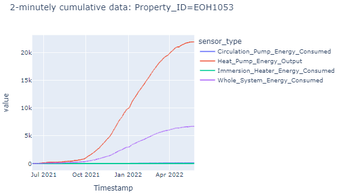
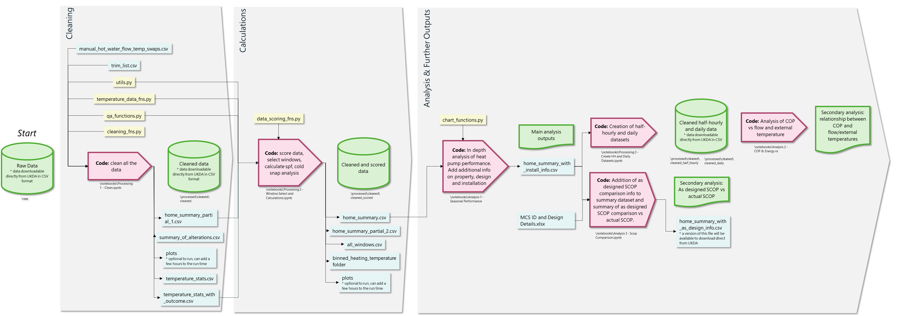

monitoring_analysis_2
==============================

## Electrification of Heat

The Electrification of Heat (EoH) demonstration project is funded by the Department for Energy Security and Net Zero (DESNZ) and seeks to better understand the feasibility of a large-scale rollout of heat pumps across the UK. It aims to demonstrate that heat pumps can be installed in a wide variety of homes and deliver high customer satisfaction across a range of customer groups.

This git repository holds notebooks which enable processing of the EoH monitoring data from its raw format through stages of cleaning, data scoring, heat pump performance calculations and analysis.

The data, along with data dictionary and links to the reports can be found in the UK data archives at:

**Note, all published datasets (2-minuntely, half-hourly, daily) show cumulative energy readings**

Example energy data represented with a line chart:



Raw 2-minutely: https://beta.ukdataservice.ac.uk/datacatalogue/studies/study?id=9049#!/details

Clean 2-minutely: https://beta.ukdataservice.ac.uk/datacatalogue/studies/study?id=9050#!/details

Clean 30-minutely: https://beta.ukdataservice.ac.uk/datacatalogue/studies/study?id=9209

Clean daily: https://beta.ukdataservice.ac.uk/datacatalogue/studies/study?id=9210

Data summary: https://usmart.io/org/esc/discovery/discovery-view-detail/6a5e5753-aaff-455e-8b3b-8ee282010261

The code can take several hours to process, speed will primarily be dependent on the format of the raw data and the specification of the machine being run on. Raw and cleaned versions of the data exist, in case you wish to skip cleaning the data and proceed to use the data for your own analysis.

### High level process flow



### Notes

The raw data along with various other inputs and outputs are not stored on gitlab but instead either locally (recommended) or on a shared/cloud drive.

Detail on the cleaning process can be found in [this document](reports/Cleansing.md).

To run the Analysis 1 - Seasonal Performance Analysis.ipynb file, you will need a free login for the usmart platform to be able to access the dataset https://usmart.io/org/esc/dataset/view-edit?datasetGUID=5325ef18-9cd1-493c-beae-e278d8998400 which is required for the analysis. You will also need to set environment variables for your USMART_KEY_ID and USMART_KEY_SECRET, these keys can be found in your profile in usmart.

In the clean.ipynb file, a file that produces temperature statistics called temperature_stats.csv takes a few hours to produce. Once this file has been created, the code can be commented out to save time if the script needs re-running.

Enabling plotting by setting Plotting = True within the Processing 1 - Clean.ipynb and the Processing 2 - Window Select and Calculations.ipynb files will produce a variety of plots within your folder. Although useful, this can add a few hours to the run time.

### Steps to move from raw data to analysis outputs

0.  Run the following commands to create a conda environment called EoH and to install relevant packages.

```
    conda config --add channels conda-forge
```

```
    conda env create --name EoH --file=environment.yml
```

1.  Set up environment variables for your os (USMART_LEY_ID, UMSART_KEY_SECRET, EoH). The environment variable EoH should point at the directory where the raw data is stored. You may need to restart your IDE after setting up new environment variables for them to be registered.
2.	Run the Processing 1 - Clean.ipynb notebook to generate the cleaned dataset.
3.	Run the Processing 2 - Window Select and Calculations.ipynb notebook to generate the home_summary.csv file and the cleaned_scored dataset.
4.	Run the following notebooks to generate the analysis outputs.

    - Analysis 1 - Seasonal Performance Analysis.ipynb - for key insights based on a year-long window of performance for each property

    - Analysis 2 - COP & Energy vs Temperature.ipynb (requires running the Processing 3 - Create HH and Daily Datasets.ipynb file) - for insights based on 30-minutely data, primarily on the impact of flow and external temperature on heat pump performance.

    - Analysis 3 - SCOP Comparison.ipynb - for insights into 'as designed' vs actual: SCOP and flow temperature

### Expected folder structure for local directory

| Level 0    | Level 1                     | Level 2                               | Level 3                | Level 4                | Notes                                               |
| ---------- | --------------------------- | ------------------------------------- | ---------------------- | ---------------------- | --------------------------------------------------- |
| processed\ | binned_heating_temperature\ | all_flow_temperatures\                |                        |                        |                                                     |
| processed\ | binned_heating_temperature\ | plots\                                | all_flow_temperatures\ |                        |                                                     |
| processed\ | cleaned\                    | cleaned\                              |                        |                        | This is where the cleaned data is stored            |
| processed\ | cleaned\                    | cleaned_scored\                       |                        |                        | This is where the cleaned and scored data is scored |
| processed\ | cleaned\                    | cleaned_daily\                        |                        |                        | This is where the cleaned and scored data is scored |
| processed\ | cleaned\                    | cleaned_daily_in_window\              |                        |                        | This is where the cleaned and scored data is scored |
| processed\ | cleaned\                    | cleaned_half_hourly\                  |                        |                        | This is where the cleaned and scored data is scored |
| processed\ | cleaned\                    | cleaned_half_hourly_in_window\        |                        |                        | This is where the cleaned and scored data is scored |
| processed\ | cleaned\                    | cleaned_scored_in_window_single_file\ |                        |                        | This is where the cleaned and scored data is scored |
| processed\ | cleaned\                    | plots\                                | double_flagged\        | corrected\             | This is where the main plots are stored             |
| processed\ | cleaned\                    | plots\                                | full\                  | change_point_analysis\ | This is where the main plots are stored             |
| processed\ | cleaned\                    | plots\                                | single_flagged\        | corrected\             | This is where the main plots are stored             |
| processed\ | cleaned\                    | plots\                                | single_flagged\        |                        | This is where the main plots are stored             |
| processed\ | cleaned\                    | plots\                                | window\                |                        | This is where the main plots are stored             |
| processed\ | for_publication\            | clean\                                |                        |                        | This folder needs to be zipped for publication      |
| processed\ | for_publication\            | raw\                                  |                        |                        | This folder needs to be zipped for publication      |
| raw\       |                             |                                       |                        |                        | This is where the raw data should be stored         |